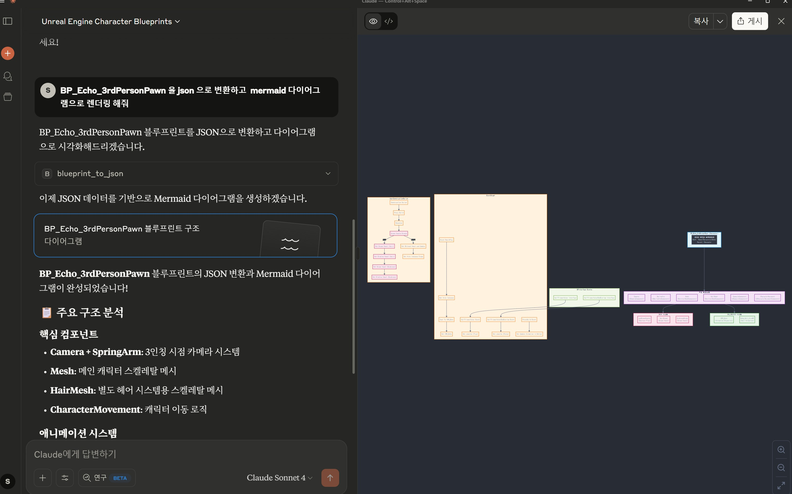

# Notice  

While I was making the Blueprint tool, I thought that it might be possible to develop games using natural language.  
So I stopped developing the Blueprint tool and started developing game development tools using natural language.  
This repository will no longer be updated.  

# Why is this necessary?

- Problem: LLM doesn't understand blueprint files.  
- Solution: This project enables LLMs to understand and manipulate blueprints.
- how?: Convert blueprints to json so that llm can understand them.  
        also, LLM can generate blueprints.

## Install
- [Install doc](docs/install.md)

## How to Use
- [how to use doc](docs/howtouse/howtouse.md)

## MCP Server Tool List  
1. **blueprint_to_json**: Convert blueprint → JSON
2. **json_to_blueprint**: Convert JSON → Blueprint
3. **save_blueprint_json**: Save JSON file validation
4. **open_blueprint_in_editor**: Open blueprint in editor
5. **get_user_manual**: View user manual
6. **validate_blueprint_json**: Validate JSON schema
7. **get_blueprint_list**: View blueprint list
8. **check_json_exists**: Check JSON file existence
9. **compile_blueprint**: Compile blueprint
10. **create_default_blueprint**: Create default blueprint (All blueprint classes that can be created in the editor)

## Example View
- on Claude Desktop
- parsing 'BP_Echo_3rdPersonPawn(Unreal ContentExample Character)' to Json and Rendering Mermaid
  

## Root of Project
- [🗡](https://github.com/LSG7/NorthStar/blob/main/README.md)
