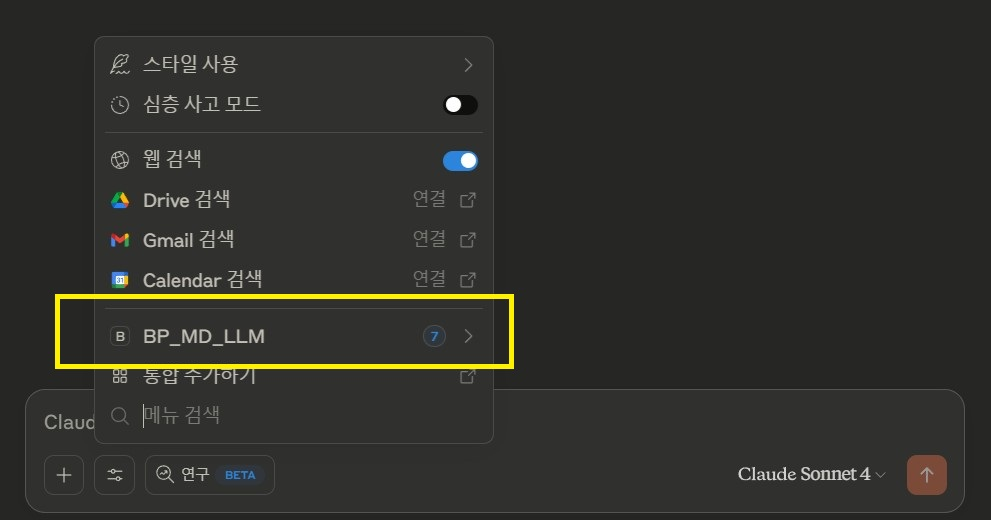

## Install Plugin

1. Download release file. https://github.com/LSG7/BP_to_LLM/releases  
   Unzip that file to the directory of your project. {Your project root}/Plugins/BP_MD_LLM  
   In Unreal, all plugins should be structured like this. It's nothing unusual.  
   Detailed for beginners.
   
2. Open your project in the editor.
   then open the Plugins window and activate the plugin called BP_MD_LLM.

## Install MCP Server for Claude Desktop 

This is not required. Install only if you use claude desktop. ( I recommend )   
Requirements: python3

1. Go into the plugins folder. (In the shell window of each operating system (cmd for Windows))
   Go into {Your Project}/Plugins/BP_MD_LLM/Resources/MCPBridge
   
2. Run python install  
   pip install -r ./requirements.txt
   
3. add following json data into
   ```
   macOS: ~/Library/Application Support/Claude/claude_desktop_config.json
   Windows: %APPDATA%\Claude\claude_desktop_config.json
   ```
   ```json
    {
      "mcpServers": {
        "BP_MD_LLM": {
          "command": "python3",
          "args": [
            "Your Project Path\\Plugins\\BP_MD_LLM\\Resources\\MCPBridge\\mcp-standard.py"
            ],
          "env": {}
        }
      }
    }
    ```
   Change 'Your Project Path'. See here https://modelcontextprotocol.io/quickstart/user#windows

4. Run test.
   ```
   python3 .\test-python-bridge.py
   ```
5. Check Claude DeskTop
   
   
   
## Install MCP Server for filesystem (not ours, recommeded option)

filesystem function  
follow the instruction: https://modelcontextprotocol.io/quickstart/user#windows
