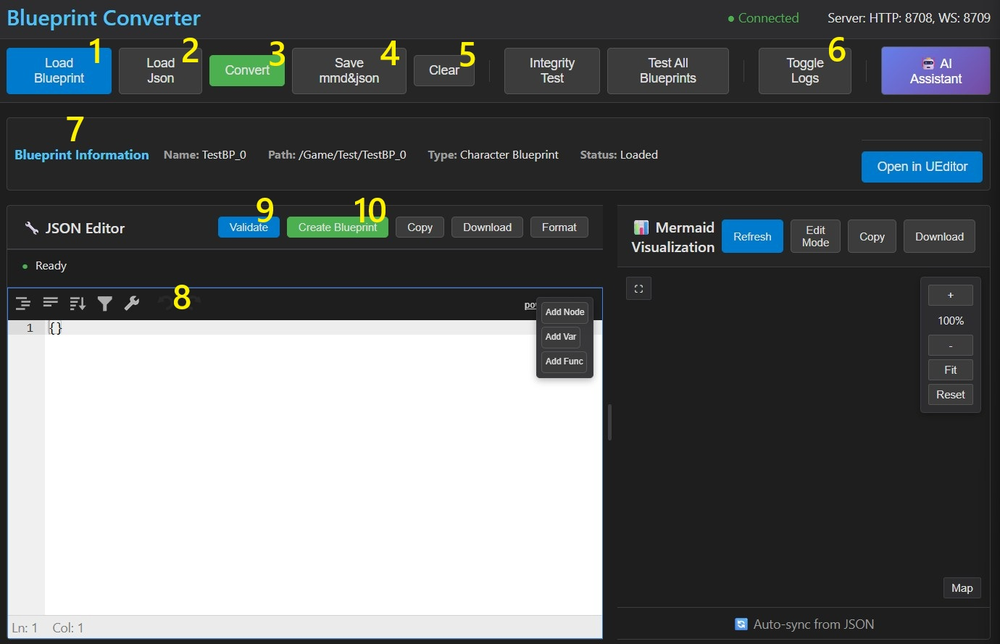
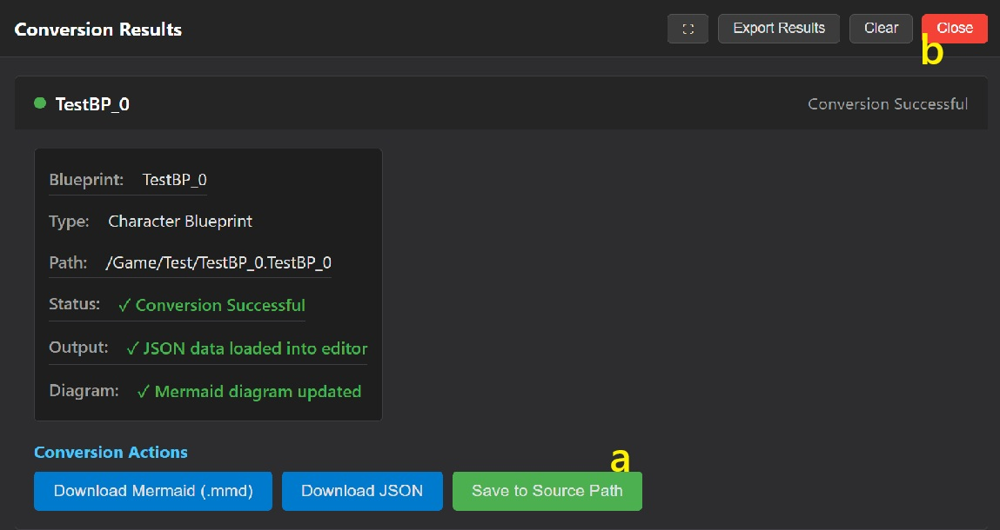

# 📘 Brief Feature Overview

### 1️⃣ **🔄 Load Blueprint**

* 📂 Loads all available Blueprints in the project.
* ✅ Enables selection from the list.
* 🔍 Blueprint details appear in the **🧾 Blueprint Information** panel.

---

### 2️⃣ **🧬 Convert**

* 🔁 Converts the selected Blueprint to:

  * 📄 **JSON**
  * 🧠 **Mermaid diagram code**
 

* 💾 Saves the `.json` file in the same location as the Blueprint (same name).
* ❎ Includes a "Close Result Panel" button.

---

### 3️⃣ **💾 Save mmd & json**

* 🗃️ Saves both `.json` and `.mmd` files using the same name and location as the Blueprint.

---

### 4️⃣ **🧹 Clear**

* ❌ Clears all content, including loaded data and editor fields.

---

### 5️⃣ **🧪 Integrity Test**

* 🛠️ Test feature only.
  *You can ignore this.*

---

### 6️⃣ **🧪 Test All Blueprints**

* 🧷 For testing purposes.
  *You can ignore this.*

---

### 7️⃣ **📜 Toggle Logs**

* 🔽 Shows/hides the log panel at the bottom of the interface.

---

### 8️⃣ **🤖 AI Assistant**

* ⏳ *Feature not yet implemented.*

---

### 9️⃣ **🧾 Blueprint Information**

* ℹ️ Shows metadata and properties of the selected Blueprint.

---

### 🔟 **📝 JSON Editor**

* ✏️ Displays the loaded or converted JSON.
* 🧱 Nodes can be added, edited, or deleted directly in the editor.

---

### 1️⃣1️⃣ **📂 Load JSON**

* 📑 Opens a dialog to import an existing `.json` file.

---

### 1️⃣2️⃣ **✔️ Validate**

* 🧹 Checks for syntax errors and validates structure in the current JSON.

---

### 1️⃣3️⃣ **🛠️ Create Blueprint**

* 🏗️ Generates a new Blueprint using the current JSON content.
* 📌 Uses the name and path defined in the JSON.
* 🔄 If a Blueprint with the same name exists, it will be renamed to `"original_name_old"` before the new one is created.

---

### 1️⃣4️⃣ **📊 Mermaid Visualization**

* 📈 Renders a diagram based on the current JSON.
* 🧩 Helps you visualize node structure and connections.

